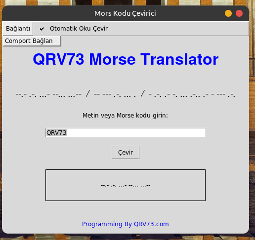

<a href="#">
    
</a>

# MorseGUI-Translator
GUI Morse to Text and Text to Morse Translator Written in Python Language Automatic Translation and Sending Directly over Amateur Radio with Accurate Implementation

Install Git Clone and Python3

Github Package Must Be Installed On Your Device.
```bash
sudo apt install git -y
```

Python3 Package Must Be Installed On Your Device.
```bash
sudo apt install python3 -y  && sudo apt install pip3 install pyserial

```

----------------------------------
https://fatihonder.org.tr/python-ile-mors-translator-gui/

# Installation
Install MorseGUI-Translator
```bash
sudo git clone https://github.com/cektor/MorseGUI-Translator.git
```
```bash
cd MorseGUI-Translator/
```

```bash
python morsgui.py
```
or

```bash
python3 morsgui.py
```
# To compile

NOTE: For Compilation Process pyinstaller must be installed. To Install If Not Installed.

pip install pyinstaller 

Linux Terminal 
```bash
pyinstaller --onefile --windowed morsgui.py
```

Windows VSCode Terminal 
```bash
pyinstaller --onefile --noconsole morsgui.py
```

MacOS VSCode Terminal 
```bash
pyinstaller --onefile --noconsole bytsconvert.py
```

# To run directly on Windows or Linux
Download and Run According to Your Operating System from the Link

https://github.com/cektor/MorseGUI-Translator/releases/tag/1.0


# Linux Screenshot

 
